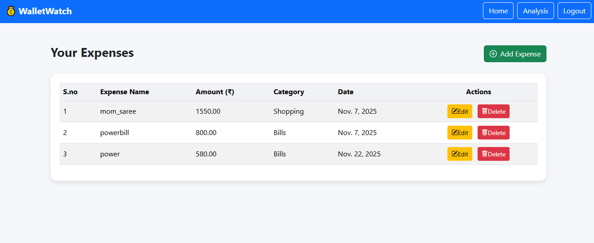
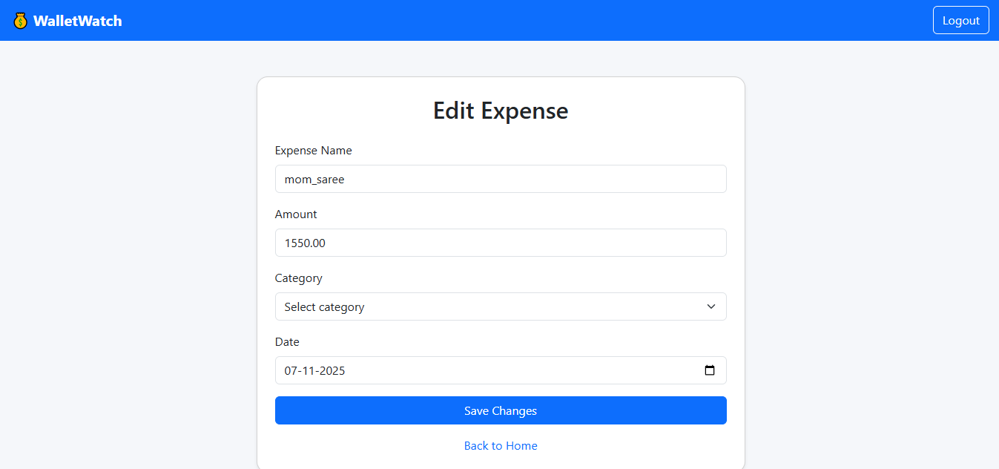
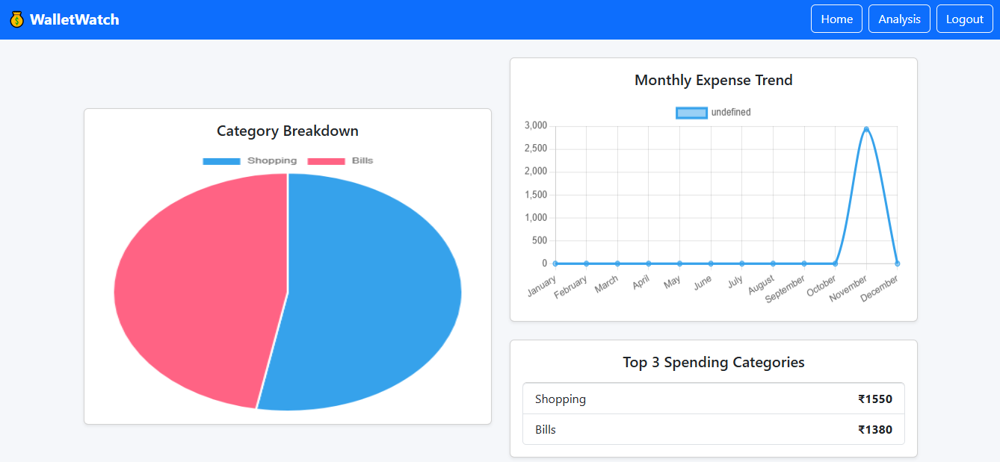
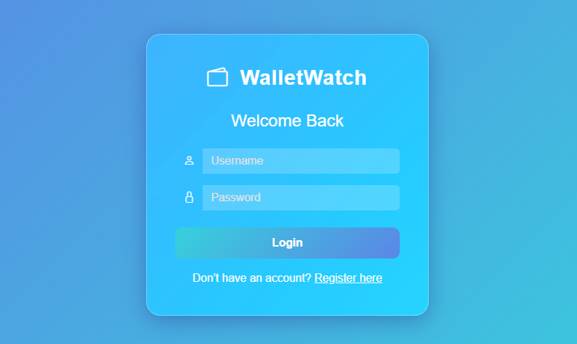
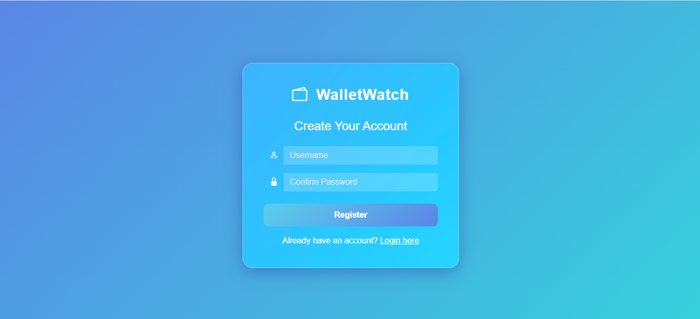

**#💰 Wallet Watch – Expense Tracker Web Application**

Wallet Watch is a **full-stack, user-authenticated expense tracker web application** that helps users manage daily expenses and analyze their spending patterns using **interactive charts and insights**.

🚀 **Live Application (Render):** https://wallet-watch-9unz.onrender.com    
📦 **GitHub Repository:** https://github.com/hema-madhuri-mamidi/Wallet-Watch

---

## ✨ Key Features

### 🔐 User Authentication
- User **Registration & Login**
- Secure **Logout**
- Each user can manage **their own expenses**

### 💸 Expense Management (CRUD)
- ➕ Add expenses
- ✏️ Edit expenses
- ❌ Delete expenses
- 📂 Category-wise expense tracking

### 📊 Expense Analytics (Chart.js)
- 🥧 **Category-wise pie chart**
- 📈 **Monthly expense trend (line graph)**
- 🔝 **Top 3 spending categories** insight

### 📱 UI & Deployment
- Responsive UI using **Bootstrap**
- Deployed on **Render**
- Source code hosted on **GitHub**

---

## 🛠️ Tech Stack

### Frontend
- HTML  
- CSS  
- Bootstrap  
- Chart.js  

### Backend
- Python  
- Django  

### Database
- SQLite  

### Deployment
- Render  

---

## 📊 Analytics & Insights

Wallet Watch provides meaningful insights to users:
- Visual breakdown of expenses by category
- Monthly spending trend analysis
- Identification of **top 3 spending categories** to help control expenses

---

## 📸 Screenshots

### 1️⃣ Home Page


### 2️⃣ Add Expense
 

### 3️⃣ Edit Expense
  

### 4️⃣ Analytics
  

### 5️⃣ Login 


### 6️⃣ Register 
  


---

## 🌐 Live Deployment (Render)

The application is deployed and accessible online using **Render**.

🔗 **Live URL:** https://wallet-watch-9unz.onrender.com 

---

## ⚙️ Run Locally (Optional)

> For developers who want to run the project locally

Follow the steps below to run the **Wallet Watch** project on your local machine.

### 1️⃣ Clone the Repository
```bash
git clone https://github.com/your-username/your-repo-name.git
cd your-repo-name
```

### 2️⃣ Create virtual environment
```bash
python -m venv venv
``` 

### 3️⃣ Activate virtual environment
```bash
venv\Scripts\activate
```

### 4️⃣ Install required Dependencies
```bash
pip install -r requirements.txt
```

### 5️⃣ Apply Database Migrations
```bash
python manage.py migrate
```

### 6️⃣ Run the Deployment Server
```bash
python manage.py runserver
```

### 7️⃣ Open the application in Browser
```Text
http://127.0.0.1:8000/
```

## 🚀 Future Enhancements

- 📅 Yearly expense reports  
- 📤 Export expenses as CSV / PDF  
- 📊 Advanced analytics & filters  
- 🤖 Expense prediction using Machine Learning  
- ☁️ Cloud database integration
---
## 🎯 Project Highlights

This project demonstrates:  
- Full-stack development using Django  
- Secure user authentication  
- Backend CRUD operations  
- Data visualization using Chart.js  
- Responsive UI design  
- Real-world deployment using Render
---
## 👩‍💻 Author

**Hema Madhuri Mamidi**  
GitHub: https://github.com/hema-madhuri-mamidi   
LinkedIn: https://linkedin.com/in/hema-madhuri-mamidi  

⭐ If you like this project, consider giving it a star!
